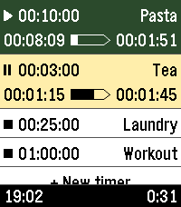

# pebble-another-timer

**Another timer**

A multi-timer watchapp for Pebble, built for fast, versatile, & straightforward usage.



**Features**:
- Instantly start timers by one touch
- Multiple timers
- Reusable saved timers
- Run-once timers
- Labeled timers
- Track remaining time, elapsed time, & overtime
- Configure timers either from the phone or from the watch
- Optionally start counting from app launch
- High configurability

## Build

```bash
npm install
make build_and_install_emulator   # compiles src/ts -> src/pkjs (tsc), bundles, installs to the emulator
```

See the `Makefile` for other targets (`clean`, `kill_emulator`, `wipe_emulator`,
`install_cloudpebble`, `create_screenshots`, ...).

Phone-side config (`src/ts/*.ts`) is TypeScript compiled to `src/pkjs/*.js` by
`tsc` (the generated JS is gitignored). Watch logic lives in `src/c/`, with the
pure, host-testable core in `timer_calc.c` (`gcc -I src/c tests/test_timer_calc.c
src/c/timer_calc.c -o /tmp/t && /tmp/t`). Run the phone-side tests with `npm test`.

## Open-source attributions

The app is originally forked from Sykerö Software's Countdown Timer, later mixed
with many extra ideas and useful features from other open source apps.

The touch dial is adopted from howeaj's Instant Timer, and the label input
keyboard from metuuu's Mölkky scorekeeper. Check out also those brilliant apps!

Attribution links:
- [https://github.com/Sykero-Software/PebbleCountdownTimer](https://github.com/Sykero-Software/PebbleCountdownTimer)
- [https://github.com/howeaj/pebble-instant-timer](https://github.com/howeaj/pebble-instant-timer)
- [https://github.com/metuuu/pebble-molkky-scorekeeper](https://github.com/metuuu/pebble-molkky-scorekeeper)

## License

GPL-3.0. The vendored `multitap_keyboard` widget (`src/c/multitap_keyboard/`)
is licensed separately under Apache-2.0.
